# Midterm Data Pipeline

Hybrid order-data processing pipeline using **Python Batch**, **Apache Spark**, **MongoDB**, **ELT**, **Data Quality**, **Quarantine**, **Idempotent Upsert**, deterministic deduplication, and execution metrics.

The project is designed for mixed-quality e-commerce order data and follows one core rule:

> Every input record is loaded to the Raw layer first. No bad record is silently dropped.

The pipeline automatically selects the processing engine according to the input file size and then applies the same business-quality policy regardless of the selected engine.

---

## Table of Contents

1. [Project Goal](#project-goal)
2. [Architecture](#architecture)
3. [Project Structure](#project-structure)
4. [Engine Selection](#engine-selection)
5. [Python Batch Path](#python-batch-path)
6. [PySpark Path](#pyspark-path)
7. [ELT Raw-First Design](#elt-raw-first-design)
8. [Data Quality Rules](#data-quality-rules)
9. [Correction Audit Trail](#correction-audit-trail)
10. [Quarantine](#quarantine)
11. [MongoDB Design](#mongodb-design)
12. [Deduplication](#deduplication)
13. [Idempotency and Upsert](#idempotency-and-upsert)
14. [Metrics](#metrics)
15. [Environment Setup](#environment-setup)
16. [Run Commands](#run-commands)
17. [Generate Test Samples](#generate-test-samples)
18. [Automated Tests](#automated-tests)
19. [Recorded Results](#recorded-results)
20. [Execution Evidence](#execution-evidence)
21. [Batch vs PySpark Comparison](#batch-vs-pyspark-comparison)
22. [Data Integrity Policy](#data-integrity-policy)
23. [Repository Data Policy](#repository-data-policy)

---

## Project Goal

The project implements a reusable hybrid data pipeline for large mixed-quality order datasets.

The pipeline must:

- process small files using memory-safe Python batch loading;
- process large files using Apache Spark;
- load every source row into MongoDB Raw before cleaning;
- distinguish safe corrections from unsafe or ambiguous data;
- preserve a correction audit trail;
- quarantine records that cannot be corrected safely;
- prevent duplicate final business records;
- support safe reruns through idempotent upsert;
- record execution metrics and error counts;
- provide practical evidence using MongoDB Compass, Spark UI, and recorded results.

Every Raw record must end in exactly one classification:

```text
Valid
Corrected
Quarantine
```

The pipeline enforces the consistency rule:

```text
Raw = Valid + Corrected + Quarantine
```

---

## Architecture

```text
                               CSV File
                                  |
                                  v
                             File Router
                                  |
                    +-------------+-------------+
                    |                           |
                    v                           v
              Python Batch                   PySpark
               <= 200 MB                     > 200 MB
                    |                           |
                    +-------------+-------------+
                                  |
                                  v
                             orders_raw
                                  |
                                  v
                      Quality / Transformation
                                  |
                     +------------+------------+
                     |                         |
                     v                         v
              Valid / Corrected            Quarantine
                     |                         |
                     |                         v
                     |                 orders_quarantine
                     |
                     v
             Deterministic Deduplication
                     |
                     v
              Idempotent Upsert
                     |
                     v
              orders_validated
                     |
                     v
             reports/results.json
```

The architecture deliberately separates routing, loading, quality transformation, MongoDB setup, upsert, metrics, and testing.

---

## Project Structure

```text
midterm-data-pipeline/
|
|-- README.md
|-- requirements.txt
|-- .gitignore
|
|-- config/
|   `-- settings.py
|
|-- data/
|   `-- .gitkeep
|
|-- src/
|   |-- __init__.py
|   |-- main.py
|   |-- file_router.py
|   |-- create_small_sample.py
|   |-- batch_loader.py
|   |-- spark_loader.py
|   |-- spark_transform.py
|   |-- spark_upsert.py
|   |-- quality_rules.py
|   |-- elt_pipeline.py
|   |-- mongo_setup.py
|   `-- metrics.py
|
|-- tests/
|   |-- test_consistency.py
|   |-- test_file_router.py
|   |-- test_idempotency_logic.py
|   `-- test_quality_rules.py
|
|-- reports/
|   |-- results.json
|   |-- results.md
|   `-- screenshots/
|
`-- docs/
    `-- architecture.md
```

### Main responsibility of each source file

| File | Responsibility |
|---|---|
| `src/main.py` | Single pipeline entry point and overall orchestration |
| `src/file_router.py` | Selects Python Batch or PySpark according to file size |
| `src/create_small_sample.py` | Generates controlled test samples without manual editing |
| `src/batch_loader.py` | Streaming CSV to Raw MongoDB in configurable batches |
| `src/spark_loader.py` | Large-file Spark orchestration, Raw load, counts and metrics |
| `src/spark_transform.py` | Distributed DataFrame-based quality transformations |
| `src/spark_upsert.py` | Distributed idempotent MongoDB upsert |
| `src/quality_rules.py` | Deterministic Python quality and normalization rules |
| `src/elt_pipeline.py` | Python Raw to quality classification to validated/quarantine |
| `src/mongo_setup.py` | MongoDB collections, validator, indexes and connection checks |
| `src/metrics.py` | Appends successful run metrics to `reports/results.json` |

---

## Engine Selection

The default threshold is:

```text
200 MB
```

Selection logic:

```text
File size <= 200 MB
    -> python_batch

File size > 200 MB
    -> pyspark
```

The decision is based on **file size**, not on the file name. The router prints file size, configured threshold, selected engine, and the reason for selection.

### Python Batch router evidence

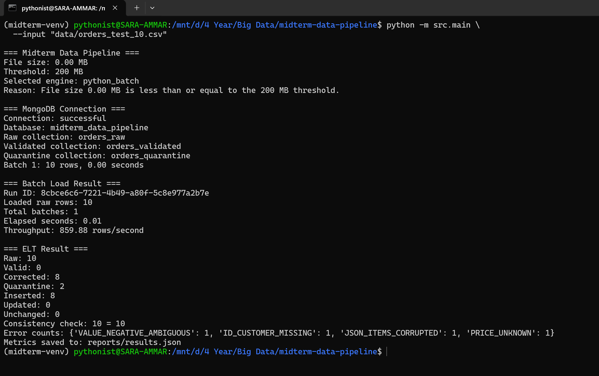

### PySpark router evidence

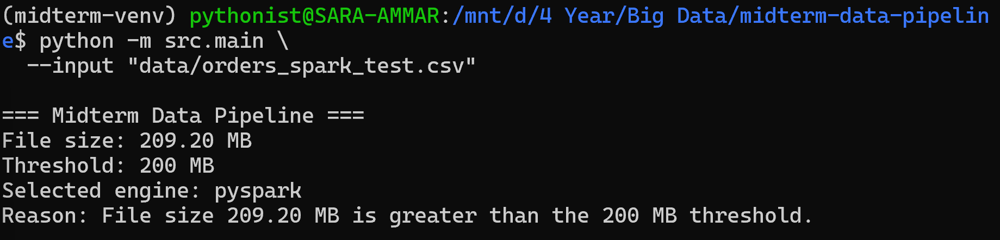

The Spark demonstration file was `orders_spark_test.csv` with size `209.20 MB`, therefore `209.20 MB > 200 MB` and the router selected `pyspark`.

---

## Python Batch Path

Files less than or equal to 200 MB are processed using the Python Batch path.

The loader uses `csv.DictReader` and does **not** load the full CSV into a Python list before Raw ingestion.

The default configured batch size is:

```text
5000 rows
```

A 12,000-row test is processed as:

```text
Batch 1: 5000
Batch 2: 5000
Batch 3: 2000
```

For each batch the implementation records the batch number, row count, elapsed batch-write time, and **per-batch throughput**. If `insert_many` fails, the loader prints the batch number, number of affected rows, elapsed time, exception type, and original failure reason, then re-raises the exception so the failure is never hidden. At run level it records loaded Raw rows, total batch count, Raw-load time, Raw-load throughput, total pipeline time, and overall pipeline throughput.

Example controlled output:

```text
Batch 1: 10 rows, 0.00 seconds
Loaded raw rows: 10
Total batches: 1
Elapsed seconds: 0.01
Throughput: 859.88 rows/second
```

The Python path loads Raw first, then the ELT pipeline processes only the records associated with the generated `run_id`.

---

## PySpark Path

Files larger than 200 MB are processed using Apache Spark.

The Spark implementation uses SparkSession, Spark DataFrame API, fixed input schema, String-based Raw fields, Spark partitions, MongoDB Spark Connector, DataFrame-based transformations, deterministic business-key deduplication, distributed MongoDB upsert, explicit persistence, and configurable SQL shuffle partitions.

**Pandas is not used for large-file processing.**

### Fixed Raw Schema

Raw fields are read using a fixed `StructType` schema. Sensitive dirty fields are kept as strings during Raw ingestion so malformed values are not destroyed by premature type coercion.

### Spark Session Configuration

```text
master = local[*]
spark.driver.memory = 6g
spark.executor.memory = 6g
spark.sql.shuffle.partitions = 64
spark.local.dir = /mnt/d/spark-temp
```

### Spark Input Partitions

A recorded 209.20 MB execution used `16` input partitions. A successful 5 GB execution used `41` input partitions.

### Shuffle Partitions

The pipeline configures `spark.sql.shuffle.partitions = 64`. Shuffle occurs during grouping, Window-based deduplication, sorting by business key, and explicit repartitioning before MongoDB upsert.

### Repartition Before MongoDB Upsert

The final validated Spark DataFrame is repartitioned by `order_id` into `8 partitions` before distributed MongoDB upsert. This controls concurrent MongoDB writers.

### Distributed MongoDB Upsert

```text
Upsert partitions: 8
Upsert batch size: 500
```

```text
Validated DataFrame
        |
        v
repartition(8, order_id)
        |
        v
mapPartitions
        |
        v
Bulk batches of 500
        |
        v
MongoDB orders_validated
```

---

## Spark Storage Strategy

Large reusable Spark DataFrames use `StorageLevel.DISK_ONLY`. Spark temporary storage is configured as `/mnt/d/spark-temp`.

```bash
mkdir -p /mnt/d/spark-temp
df -h /mnt/d/spark-temp
```

---

## ELT Raw-First Design

```text
Extract
   |
   v
Load Raw
   |
   v
Transform / Validate
```

Each Raw document preserves `run_id`, `source_file`, `source_row_number`, `ingested_at`, `engine_used`, and `raw_record`.

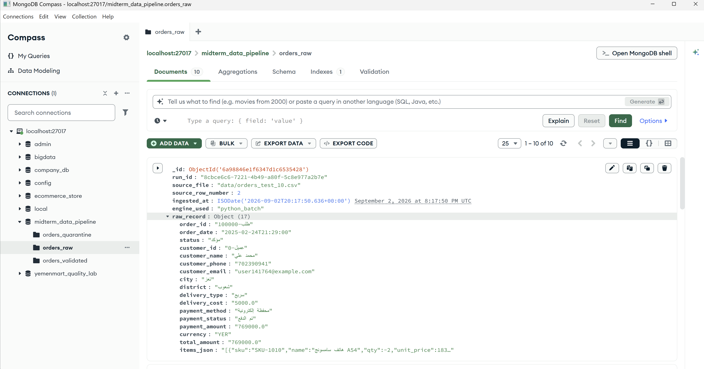

---

## Data Quality Rules

The project implements more than the required minimum of eight deterministic correction rules.

| Rule | Purpose |
|---|---|
| Arabic digit normalization | Converts known Arabic digits to Latin digits |
| Thousands separator removal | Normalizes numeric text such as `125,000` |
| Known Arabic price-word conversion | Converts only explicitly supported known price words |
| Currency normalization | Standardizes known currency names/symbols |
| Phone normalization | Removes formatting and normalizes safe phone forms |
| Email normalization | Repairs clearly repeated symbols when deterministic |
| Date normalization | Parses supported valid date forms into a standard representation |
| Status alias normalization | Maps known status aliases to standard values |
| Trim normalization | Removes leading/trailing whitespace |
| Numeric normalization | Converts clean numeric values after safe normalization |
| Item validation | Parses and validates `items_json` |
| Total recomputation | Recalculates total when components are valid |

The pipeline never guesses ambiguous values. Unsafe records are quarantined.

---

## Correction Audit Trail

Every corrected final record preserves `field`, `original_value`, `corrected_value`, and `rule_code`.

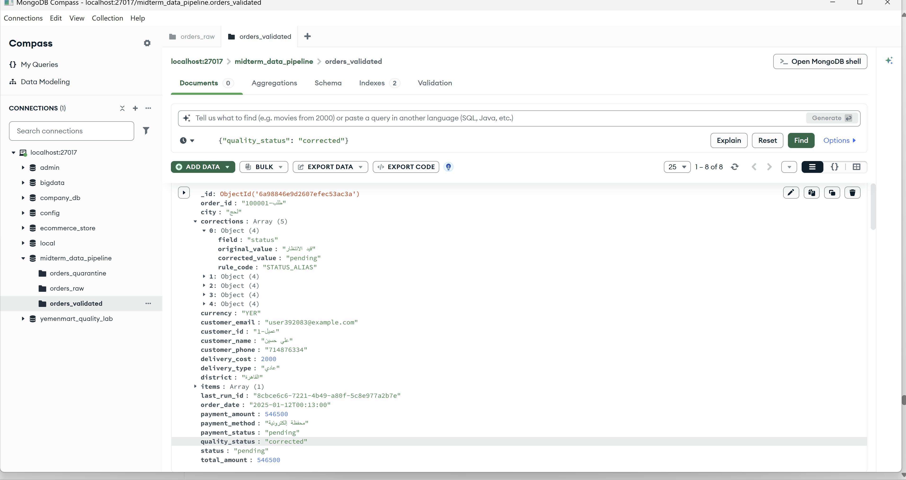

---

## Quarantine

Records that cannot be corrected safely are written to `orders_quarantine`. Each quarantine document preserves `run_id`, `order_id` when available, `error_codes`, `error_details`, and `raw_record`.

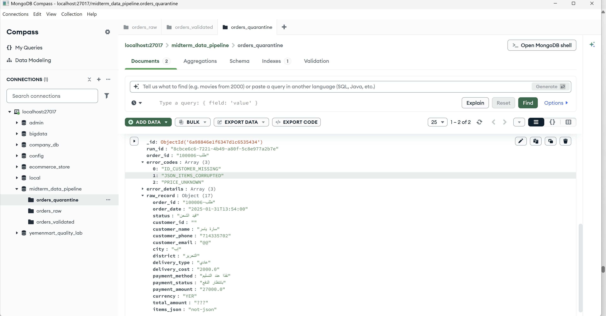

Example codes include `ID_ORDER_MISSING`, `ID_CUSTOMER_MISSING`, `DATE_INVALID_IMPOSSIBLE`, `PHONE_INVALID`, `EMAIL_INVALID`, `PRICE_UNKNOWN`, `JSON_ITEMS_CORRUPTED`, `ITEMS_EMPTY`, and `VALUE_NEGATIVE_AMBIGUOUS`.

---

## Record Classification

The pipeline verifies:

```text
raw_count = valid_count + corrected_count + quarantine_count
```

### 500,000-row Spark run

```text
1,872 + 470,254 + 27,874 = 500,000
```

### 5 GB successful run

```text
45,335 + 11,443,532 + 682,812 = 12,171,679
```

---

## MongoDB Design

Database: `midterm_data_pipeline`

Collections:

```text
orders_raw
orders_validated
orders_quarantine
```

`orders_raw` keeps all input history without a business-key unique index that could reject dirty or duplicate Raw values.

`orders_validated` stores final accepted business records and uses the unique index `uq_order_id` on `order_id`.

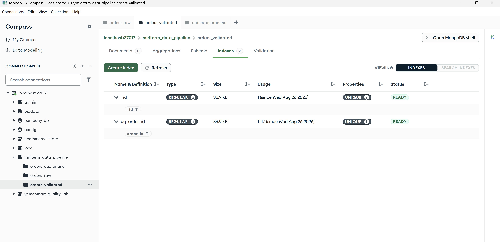

MongoDB schema validation is configured on `orders_validated`.

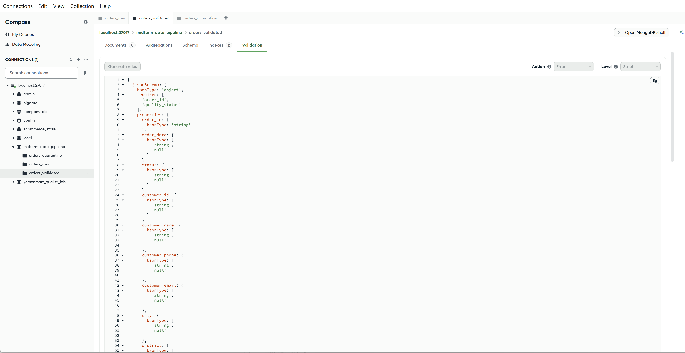

---

## Deduplication

The stable business key is `order_id`. Spark performs deterministic deduplication before the final upsert.

### 500,000-row example

```text
1,872 + 470,254 = 472,126 accepted before dedup
472,126 - 3,278 = 468,848 validated unique
```

### 5 GB example

```text
45,335 + 11,443,532 = 11,488,867 accepted before dedup
11,488,867 - 80,733 = 11,408,134 validated unique
```

---

## Idempotency and Upsert

```text
New order_id -> Inserted
Existing order_id + changed business data -> Updated
Existing order_id + same business state -> Unchanged
```

### First Run

```text
Inserted: 8
Updated: 0
Unchanged: 0
```

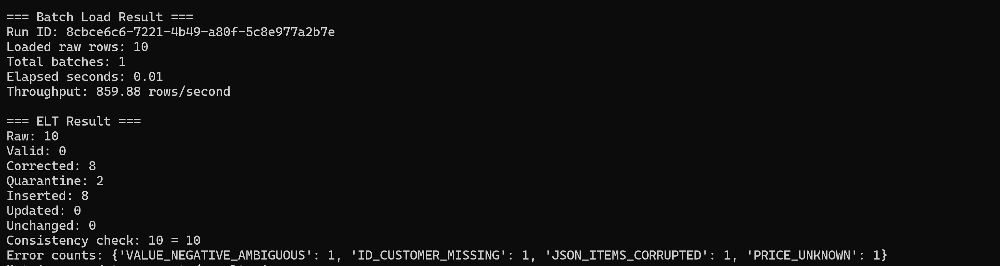

### Exact Same Input Again

```text
Inserted: 0
Updated: 0
Unchanged: 8
```

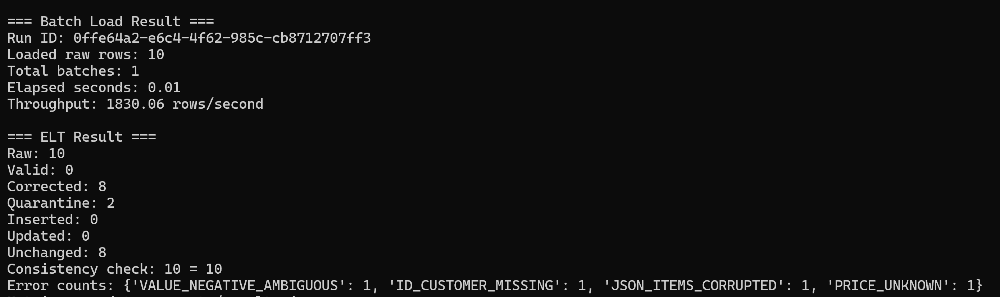

### Controlled Update of One Existing Record

Target:

```text
order_id = طلب-100001
customer_name: علي حسين -> علي حسين UPDATED
```

Result:

```text
Inserted: 0
Updated: 1
Unchanged: 7
Validated records: 8
```

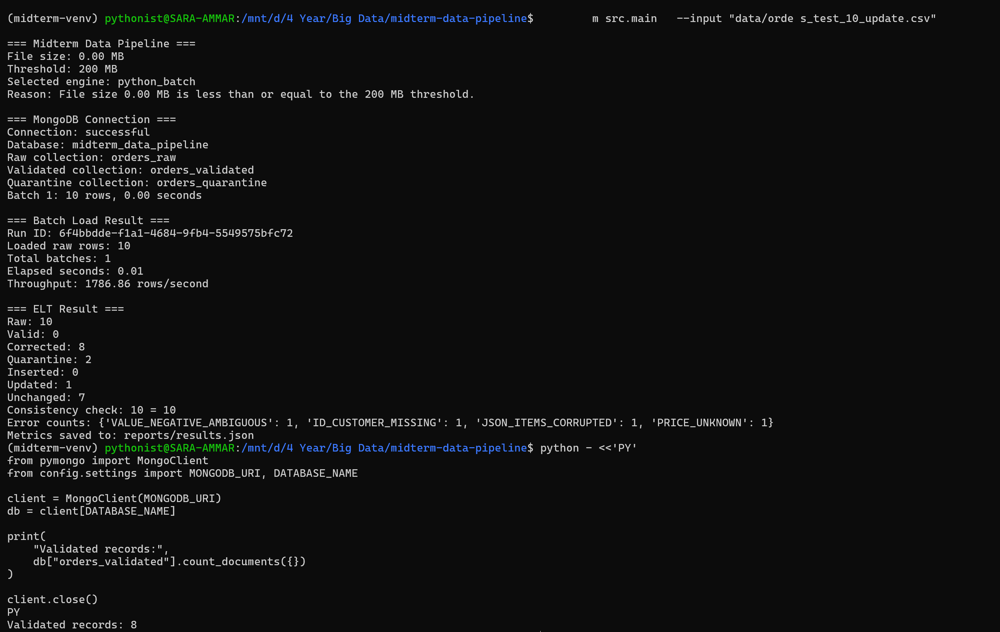

---

## Metrics

Successful executions are appended to `reports/results.json`. Metrics include run ID, file name/size, engine, Raw/Valid/Corrected/Quarantine counts, elapsed time, throughput, partitions or batch settings, error counts, and Inserted/Updated/Unchanged counts.

---

## Environment Setup

```bash
cd "/mnt/d/4 Year/Big Data/midterm-data-pipeline"
source ~/midterm-venv/bin/activate
pip install -r requirements.txt
```

Find current WSL gateway:

```bash
ip route | grep default
```

Then:

```bash
export MONGODB_URI="mongodb://<CURRENT_GATEWAY_IP>:27017/"
```

Test MongoDB:

```bash
python - <<'PY_CHECK_MONGO'
import os
from pymongo import MongoClient
client = MongoClient(os.environ["MONGODB_URI"], serverSelectionTimeoutMS=5000)
print(client.admin.command("ping"))
client.close()
PY_CHECK_MONGO
```

Initialize MongoDB:

```bash
python -m src.mongo_setup
```

Prepare Spark storage:

```bash
mkdir -p /mnt/d/spark-temp
df -h /mnt/d/spark-temp
```

---

## Run Commands

```bash
python -m src.main --input "data/orders_test_10.csv"
python -m src.main --input "data/orders_batch_test.csv"
python -m src.main --input "data/orders_spark_test.csv"
python -m src.main --input "data/orders_large_1gb.csv"
python -m src.main --input "data/orders_large_5gb.csv"
```

---

## Generate Test Samples

```bash
python -m src.create_small_sample --input "/path/to/orders_huge_mixed_quality.csv" --output "data/orders_test.csv" --rows 10000
python -m src.create_small_sample --input "/path/to/orders_huge_mixed_quality.csv" --output "data/orders_large_1gb.csv" --size-gb 1
python -m src.create_small_sample --input "/path/to/orders_huge_mixed_quality.csv" --output "data/orders_large_5gb.csv" --size-gb 5
```

---

## Automated Tests

The repository contains automated tests for the core required behaviors:

```text
tests/test_quality_rules.py
tests/test_consistency.py
tests/test_file_router.py
tests/test_idempotency_logic.py
```

Run:

```bash
python -m unittest discover -s tests -v
```

Latest verified result:

```text
Ran 21 tests in 0.009s

OK
```

The 21 passing tests cover:

- Router boundary behavior, including 5 MB, 200 MB and 201 MB cases;
- Raw/classified consistency;
- same-record idempotency;
- changed-record update detection;
- Arabic digit normalization;
- thousands separator normalization;
- price-word normalization;
- currency normalization;
- date normalization;
- phone normalization;
- email normalization;
- status aliases;
- `items_json` validation;
- negative/ambiguous item handling;
- total recomputation.


## Recorded Results

### Python Batch — 12,000 Rows

```text
File size: 5.01 MB
Rows: 12,000
Engine: python_batch
Batch size: 5,000
Batch count: 3
```

### PySpark — 500,000 Rows

```text
File size: 209.20 MB
Raw: 500,000
Valid: 1,872
Corrected: 470,254
Quarantine: 27,874
Duplicate business rows removed: 3,278
Validated unique: 468,848
Inserted: 468,848
Updated: 0
Unchanged: 0
Input partitions: 16
Upsert partitions: 8
```

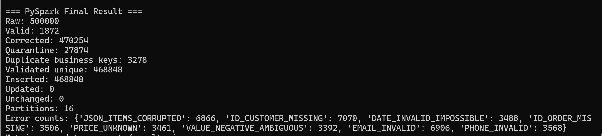

### PySpark — 1 GB Successful Benchmark

```text
File size: 1,024 MB
Rows: 2,439,999
Valid: 8,970
Corrected: 2,294,249
Quarantine: 136,780
Duplicate business rows removed: 16,079
Validated unique: 2,287,140
Elapsed: 178.42 seconds
Throughput: 13,675.31 rows/second
Input partitions: 16
Upsert partitions: 8
```

### PySpark — 5 GB Successful Large-Scale Benchmark

Run ID:

```text
aed8bab5-0dc7-410c-9a35-fe8b5e08cc28
```

```text
File: orders_large_5gb.csv
File size: 5,120 MB
Rows read: 12,171,679
Engine: pyspark
Raw: 12,171,679
Valid: 45,335
Corrected: 11,443,532
Quarantine: 682,812
Duplicate business rows removed: 80,733
Validated unique: 11,408,134
Elapsed time: 1,588.8493 seconds (~26m 29s)
Throughput: 7,660.69 rows/second
Input partitions: 41
Upsert partitions: 8
```

Error counts:

```text
JSON_ITEMS_CORRUPTED:       170,398
ID_CUSTOMER_MISSING:        170,595
DATE_INVALID_IMPOSSIBLE:     85,536
ID_ORDER_MISSING:            85,333
PRICE_UNKNOWN:               85,002
VALUE_NEGATIVE_AMBIGUOUS:    85,289
EMAIL_INVALID:              170,146
PHONE_INVALID:               85,519
```

---

## Execution Evidence

### Spark Router


### Spark Jobs

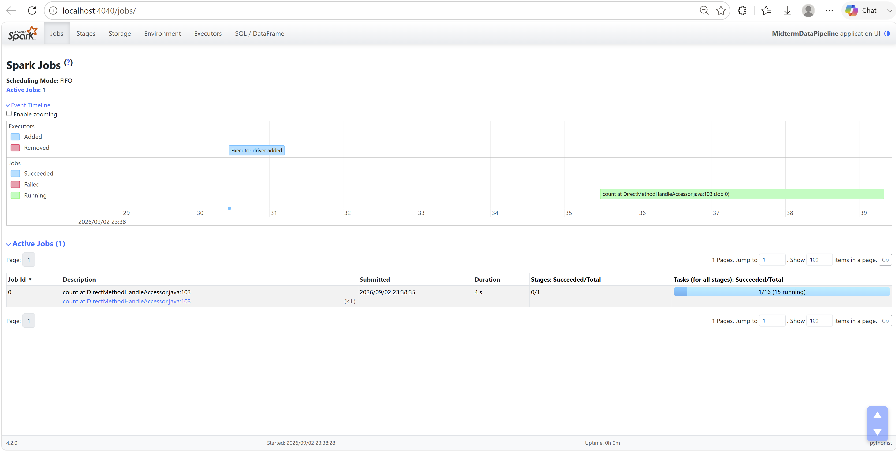

### Spark SQL / DataFrame Executions

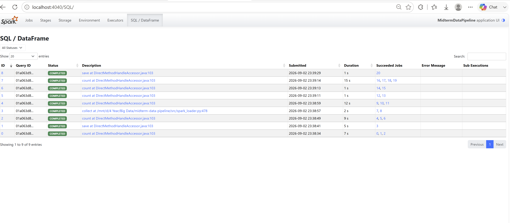

### Spark Executors

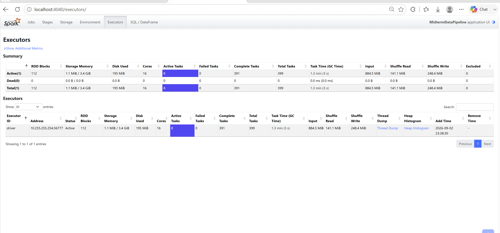

Recorded UI values include:

```text
Cores: 16
Active Tasks: 8
Complete Tasks: 391
Total Tasks: 399
Input: 884.5 MiB
Shuffle Read: 141.1 MiB
Shuffle Write: 248.4 MiB
```

### Spark Environment

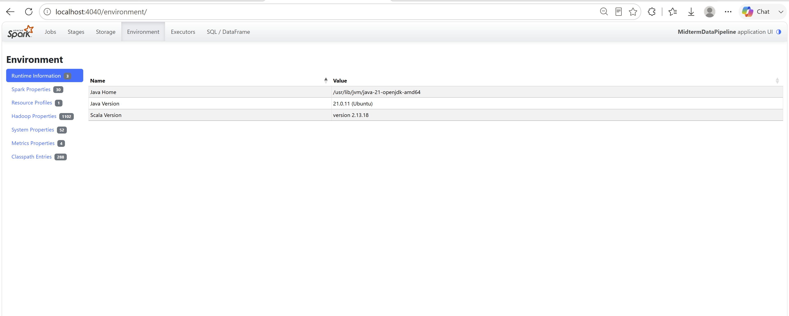

### Spark Storage

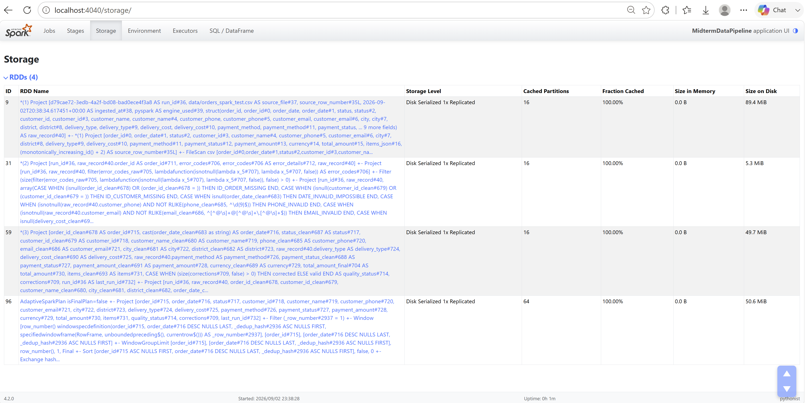

### Spark Stages

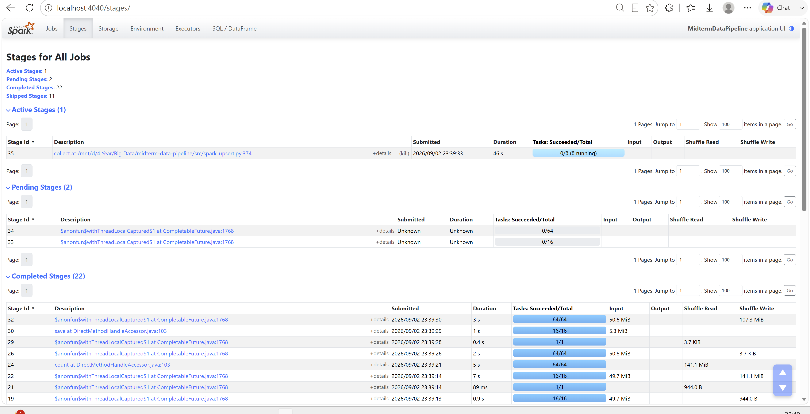

The UI shows 8-task, 16-task and 64-task stages and real Shuffle Read/Write activity.

### Completed Spark Stages

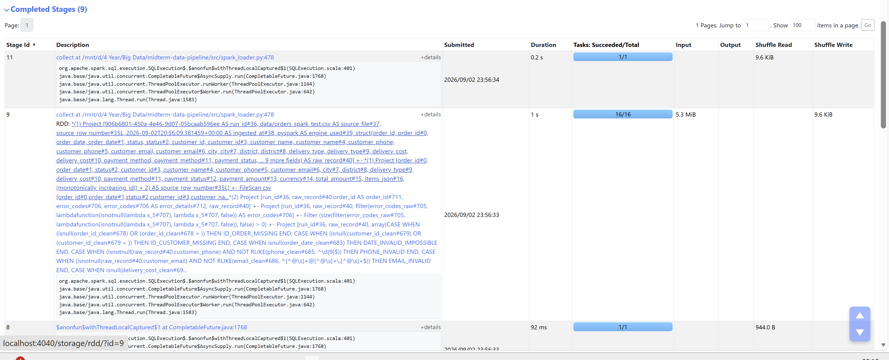

---

## Batch vs PySpark Comparison

| Metric | Python Batch | PySpark Live Test | PySpark Large Benchmark |
|---|---:|---:|---:|
| Input file | `orders_batch_test.csv` | `orders_spark_test.csv` | `orders_large_5gb.csv` |
| File size | 5.01 MB | 209.20 MB | 5,120 MB |
| Rows | 12,000 | 500,000 | 12,171,679 |
| Selected engine | `python_batch` | `pyspark` | `pyspark` |
| Batch size | 5,000 | N/A | N/A |
| Batch count | 3 | N/A | N/A |
| Raw-load throughput | 29,412.80 rows/s | N/A | N/A |
| Overall pipeline throughput | 1,014.92 rows/s | recorded in run metrics | 7,660.69 rows/s |
| Input partitions | N/A | 16 | 41 |
| Upsert partitions | N/A | 8 | 8 |
| Execution model | Streaming batches | Spark DataFrame partitions | Spark DataFrame partitions |
| Raw-first ELT | Yes | Yes | Yes |
| Idempotent final upsert | Yes | Yes | Yes |

---

## Data Integrity Policy

The original source dataset is not manually modified to improve results. Controlled tests, including the one-record update test, are generated programmatically. No invalid source rows are removed before Raw loading.

---

## Repository Data Policy

Large generated CSV files are intentionally not required to be stored in Git. The repository contains source code, configuration, tests, documentation, reports and screenshots. Large test samples can be regenerated with `src/create_small_sample.py`.

---

## Practical Demo Sequence

```text
1. Run orders_test_10.csv -> python_batch
2. Show orders_raw before cleaning
3. Show corrected audit trail
4. Show quarantine reasons
5. Show unique index and validator
6. Rerun same 10-row input -> Unchanged 8
7. Run controlled update -> Updated 1, validated remains 8
8. Run orders_spark_test.csv -> pyspark
9. Show Spark Jobs / Stages / Tasks / Partitions / Shuffle
10. Show final Spark result
11. Show reports/results.json
12. Explain successful 5 GB run
```

---

## Summary

The project demonstrates automatic routing, Python streaming batch loading with per-batch throughput and explicit failure reporting, Spark large-file processing, Raw-first ELT, deterministic quality correction, audit trail, quarantine, stable business key, unique index, MongoDB schema validation, deterministic deduplication, idempotent upsert, execution metrics, Spark UI evidence, 21 passing automated tests, and successful 500K, 1 GB and 5 GB runs.
